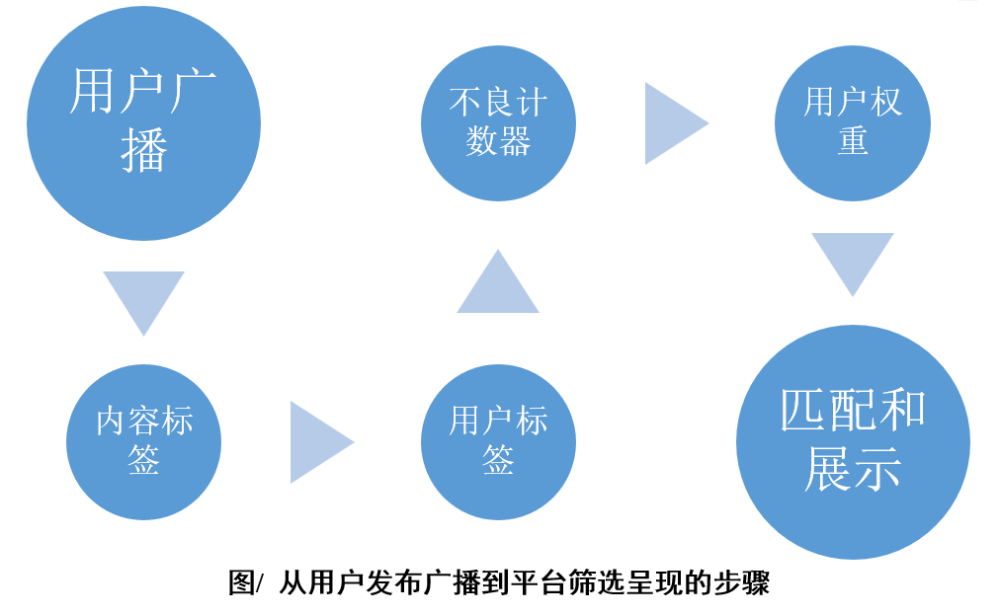

# Dot2Dot 中文说明

🔗 **立即体验**: [https://cy-dogear.github.io/dot2dot/](https://cy-dot2dogear.github.io/dot2dot/)

📖 **[English Version](./README.md)**

---

## 项目缘起

我反感注意力经济的弊端，然而抱怨并无用处。那些大型社交平台在此潮流中采取纵容态度——为了盈利，可以理解。但真、善、美在与假、恶、丑的博弈中往往处于劣势。

好在进入 2025 年，我们可以大规模使用 AI 了。**Dot2Dot 的核心特点是用 AI 解析用户发布内容，将价值观趋同的内容以更高概率展示出来。**

但我们不做“价值观暴君”。不被鼓励的内容不会被直接禁止，只是出现的概率更低。

> 当湖水还浅的时候，您能看到湖底的岩石；随着源头活水越来越多流入，您将看到一湖海蓝！

---

## 产品定位

**「找得到点对点的连接，看得见精神生活内容」**

- 本平台不适合需要“点对网”连接的用户（如树洞、单纯分享或记录）。
- 连接应该基于 **兴趣爱好**，而不是婚恋、长期关系或交易。
- “兴趣爱好”在这里被严格定义为：**没有必要做、但自主喜欢做、且可以经常做的事情**。
    - 例如：喝大酒（影响健康）或约P（违背公序良俗）不在此列。

我们追求的不是用户留存或活跃度，而是 **对用户有用**。用户觉得有用，用完离开，也是平台的价值。

---

## 设计举措

### 一、做减法

砍掉与核心定位不相关的功能：

- ❌ 不显示关注/被关注列表、性别、年龄、头像、职业
- ❌ 无留言、评论、点赞、私聊功能
- ❌ 不支持图片和视频，仅纯文本
- ✅ 默认联系方式为 **Email**（显示在个人主页）
- ✅ 登录/注册不要求密码验证或邮箱验证（邮箱仅作为 user_id 白名单）
- ✅ 长期未登录的用户记录将被自动删除
- ✅ 每人每天最多展示 **1 条**广播（其余排队），总展示上限 **20 条**（FIFO）

### 二、以 AI 赋能的筛选机制

让好内容优先呈现，实现 **「找得到点对点的连接，看得见精神生活内容」**。

详细机制参见：
- 📄 [内容标签（Message_tag）机制](./design-record-doc/message-tag.md)
- 📄 [用户标签（User_tag）机制](./design-record-doc/user-tag.md)
- 📄 [用户权重（User_weight）计算](./design-record-doc/user-weight.md)
- 📄 [发现与匹配机制](./design-record-doc/matching.md)

**算法流程图概览：**  

---

## 总结

Dot2Dot 是一个：
- **有道德** 的交友平台
- 利用 **AI** 筛选用户和内容权重
- 区别于那些默许或纵容擦边、成瘾机制、表演压力和轻度伤害内容的主流平台
- 适合需要 **点对点兴趣交友** 且注重健康价值观的人群

初始实现： [https://cy-dogear.github.io/dot2dot/](https://cy-dogear.github.io/dot2dot/)

---

## 许可证

本项目开源，详见 [LICENSE](./LICENSE) 文件。